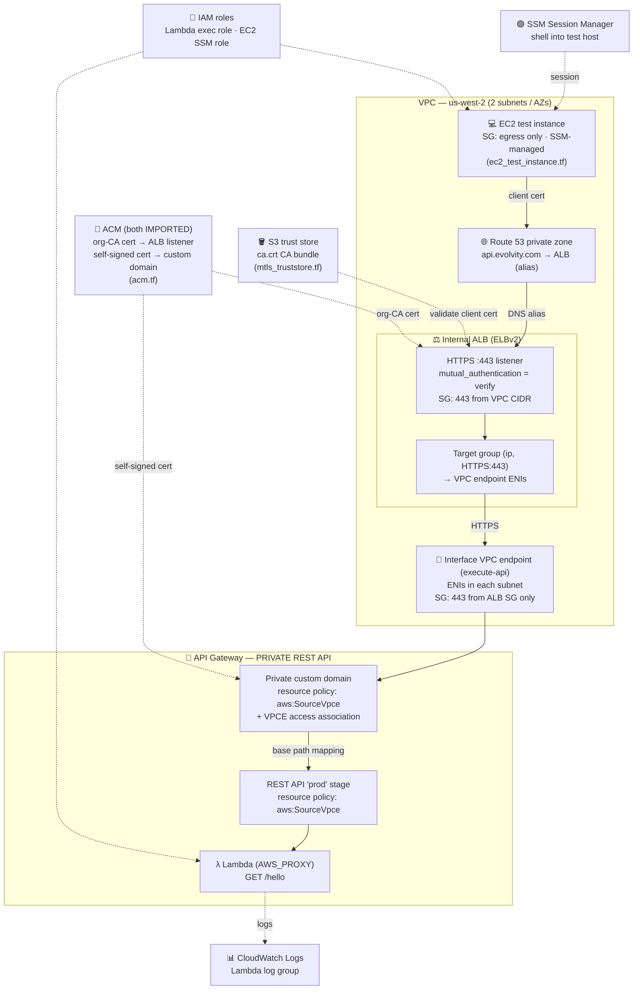

# Private API Gateway with a Private Custom Domain + mutual TLS

Terraform for an **internal-only** REST API Gateway, fronted by a **private
custom domain** and reachable only from inside a VPC through an interface VPC
endpoint. A small Lambda backs a `GET /hello` route as a working example.

Mutual TLS (mTLS) is added by an **internal Application Load Balancer** that
terminates and validates client certificates in front of the private API.
Native API Gateway mTLS only works on *regional* custom domains and is **not**
supported on private APIs, so the ALB provides that layer while the API stays
fully private. See [RUNBOOK.md](RUNBOOK.md) for the deploy/test walkthrough.

> **Status:** deployed and validated in `us-west-2` (`api.evolvity.com`).
> Requests with a trusted client cert reach the Lambda; requests with no cert or
> an untrusted cert are rejected at the TLS handshake.

## Architecture

```
            (inside the VPC, client presents an org-CA-signed client cert)
client ──► Route 53 private zone (api.evolvity.com)
              │  alias
              ▼
        Internal ALB ── HTTPS listener, mutual_authentication = "verify"
              │            ├─ server cert: org-CA-signed (clients verify it)
              │            └─ trust store: org CA bundle in S3 (validates client)
              │  forward (HTTPS) to VPC endpoint ENI IPs
              ▼
        Interface VPC endpoint (execute-api)
              │  domain-name access association
              ▼
        Private custom domain ──(base path mapping)──► REST API "prod" stage
              │  server cert: self-signed (internal; ALB              │
              │  does not verify it) · resource policy                ▼
              ▼                                              Lambda (AWS_PROXY)
        aws:SourceVpce check

  Org PKI (scripts/gen-pki.sh): one CA issues the client cert, the ALB server
  cert, and is the trust store. The private domain uses a separate self-signed
  cert because a private custom domain won't serve a CA-signed cert.
```

Full architecture, all AWS services involved:



> 📌 The hop `ALB → VPC endpoint` is plain HTTPS inside the VPC; mTLS is
> terminated at the ALB. The API Gateway itself never leaves the PRIVATE box.

### AWS services involved

| Service | Role in this setup |
|---------|--------------------|
| **Route 53** | Private hosted zone; alias record `api.evolvity.com` → ALB |
| **ELBv2 (ALB)** | Internal ALB, mTLS HTTPS listener + IP target group, ALB security group |
| **ACM** | Two imported certs: org-CA-signed (ALB listener, client-facing) and self-signed (private custom domain, internal) |
| **S3** | Trust store bucket holding the CA bundle (`ca.crt`) for client-cert validation |
| **VPC Interface Endpoint** | `execute-api` ENIs; security group locked to the ALB only |
| **API Gateway** | Private REST API, private custom domain, resource policies (`aws:SourceVpce`) |
| **Lambda** | `GET /hello` backend (AWS_PROXY integration) |
| **IAM** | Lambda execution role + EC2 SSM role |
| **CloudWatch Logs** | Lambda log group |
| **EC2 + SSM** | In-VPC test host and Session Manager access for validation |
| **Security Groups** | ALB (443 from VPC CIDR), VPCE (443 from ALB SG), EC2 (egress only) |

Access is gated by independent, layered controls:

1. **mTLS at the ALB** – the HTTPS listener runs in `verify` mode against a
   trust store (CA bundle in S3); requests without a valid client cert are
   rejected at the edge ([mtls_alb.tf](mtls_alb.tf), [mtls_truststore.tf](mtls_truststore.tf)).
2. **VPC endpoint security group** – only allows 443 from the **ALB's**
   security group, so the endpoint can't be hit directly ([vpc_endpoint.tf](vpc_endpoint.tf)).
3. **REST API resource policy** – `aws:SourceVpce` condition ([api_gateway.tf](api_gateway.tf)).
4. **Domain-name resource policy** – `aws:SourceVpce` condition ([custom_domain.tf](custom_domain.tf)).
   Private custom domains are authorized against the `/domainnames/...` resource,
   which the REST API policy does **not** cover — this policy is required.

## Files

| File | Purpose |
|------|---------|
| [providers.tf](providers.tf) | AWS + archive providers, region from `var.aws_region` (default `us-west-2`) |
| [variables.tf](variables.tf) | Input variables |
| [acm.tf](acm.tf) | Two ACM imports: org-PKI CA-signed cert (ALB listener) + self-signed cert (private custom domain) |
| [api_gateway.tf](api_gateway.tf) | Private REST API, `/hello` method, integration, deployment, stage, resource policy |
| [lambda.tf](lambda.tf) / [code/lambda.py](code/lambda.py) | Lambda function, role, log group, and the API Gateway invoke permission |
| [vpc_endpoint.tf](vpc_endpoint.tf) | Interface VPC endpoint, its security group (ALB-only ingress), and the domain-name access association |
| [custom_domain.tf](custom_domain.tf) | Private custom domain, its resource policy, and the base path mapping |
| [mtls_alb.tf](mtls_alb.tf) | Internal ALB, its security group, the mTLS HTTPS listener, and the VPC-endpoint target group |
| [mtls_truststore.tf](mtls_truststore.tf) | S3 bucket + CA bundle object + ALB trust store |
| [scripts/gen-pki.sh](scripts/gen-pki.sh) | Org PKI: generates the CA, the server cert, and a client cert (all CA-signed) into `certs/pki/` |
| [route53_private.tf](route53_private.tf) | Private hosted zone + alias record to the ALB |
| [ec2_test_instance.tf](ec2_test_instance.tf) | Optional test EC2 instance (SSM-managed) for in-VPC validation |
| [outputs.tf](outputs.tf) | API id, invoke URL, custom domain, ALB DNS name, trust store ARN |

## Prerequisites

- An existing VPC and two subnets.
- An **org PKI** (one CA) that issues the client-facing server cert and the
  client certs. Here it's simulated locally by [scripts/gen-pki.sh](scripts/gen-pki.sh);
  Terraform imports the org-CA-signed server cert into ACM (Type IMPORTED,
  [acm.tf](acm.tf)) for the **ALB listener** (what clients verify). The
  **private custom domain** gets a separate **self-signed** cert (also in
  [acm.tf](acm.tf)) — a private custom domain won't serve a CA-signed cert, and
  the ALB doesn't verify the backend cert, so it's internal-only. Run the script
  before `terraform apply` so the cert files exist.
- Terraform with the AWS provider **>= 5.34** (pinned `~> 5.0` in
  [providers.tf](providers.tf); 5.34 is the first release with private custom
  domain support) and the `archive` provider `~> 2.4`.
- AWS credentials with permission to manage the resources.

## Usage

Full step-by-step instructions — including CA generation and mTLS testing —
are in **[RUNBOOK.md](RUNBOOK.md)**. The short version:

```bash
cp terraform.tfvars.example terraform.tfvars   # then fill in your values
./scripts/gen-pki.sh                            # org PKI: CA + server + client certs
terraform init
terraform apply
```

## Testing

Run from a host **inside the VPC** (the EC2 instance via SSM Session Manager),
presenting the client certificate. Full steps — including how to reach the test
host and copy the cert onto it — are in [RUNBOOK.md](RUNBOOK.md) §4.

```bash
# ✅ valid client cert → reaches the Lambda
curl -sk --cert client.crt --key client.key https://api.evolvity.com/hello
# Hello from PRIVATE API

# ❌ no client cert → ALB rejects the TLS handshake
curl -sk https://api.evolvity.com/hello; echo "exit=$?"
# (no body) exit=35
```

Notes:
- The stage is baked into the base path mapping, so the URL is `/hello`, **not**
  `/prod/hello`. The `/prod/...` form only applies to the raw `execute-api`
  `invoke_url` output.
- The ALB server cert is issued by the org CA, so use `-k` to skip *server*
  verification, **or** verify it properly with `--cacert certs/pki/ca.crt` (the
  same org CA). The mTLS *client* auth (`--cert`/`--key`) is enforced regardless.

## Notes / limitations

- **mTLS is terminated at the ALB, not API Gateway.** Native API Gateway mutual
  TLS requires a *regional* custom domain and is not available on private APIs,
  which is why the ALB exists. The hop from ALB to the VPC endpoint is plain
  HTTPS inside the VPC (the ALB does not re-present a client cert).
- A single **org CA** (`scripts/gen-pki.sh`, POC-grade, no revocation) issues
  the client-facing server cert and client certs and is the ALB trust store. For
  production, use your real PKI / AWS Private CA and add a CRL to the trust store.
- **Two server certs by necessity.** The ALB listener uses the org-CA-signed
  cert (clients verify it against the org CA). The **private custom domain uses
  a self-signed cert** — a private API Gateway custom domain will not serve a
  CA-signed cert (its TLS frontend resets the connection). Since the ALB never
  verifies the backend cert, that self-signed cert is internal-only and
  invisible to clients.
- The ALB target group points at the VPC endpoint ENI **private IPs**, derived
  with one target per subnet. If you change the subnet count, the target
  attachments follow `length(var.subnet_ids)`.
- `private_dns_enabled = false` on the VPC endpoint is intentional — private DNS
  must be off when routing through a private custom domain access association.
- State is local and gitignored. For team use, switch to a remote backend
  (S3 + DynamoDB lock).
- `ec2_test_instance.tf` is for testing only; remove or leave it disabled in
  real deployments.
